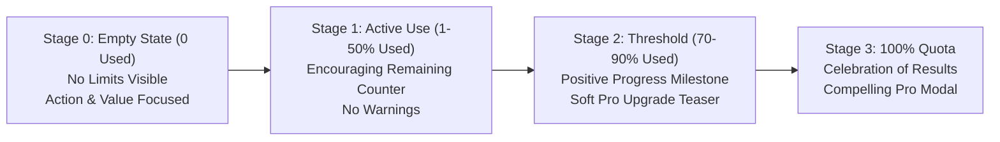

# Smart Usage Limits & Progressive Disclosure UX Plan
**Target Release:** Version 1.2.6  
**Focus:** Product-Led Growth (PLG), User Onboarding Retention, and Progressive Friction UX

---

## 1. Executive Summary & Core Philosophy

### The Problem: "Premature Friction" in Empty States
When a new user installs **AI Marketing Expert (Free)**, they are in an **Exploration & Discovery Phase** looking for immediate value. If the very first thing they see on empty dashboards or editors is:
- `0 / 30 Campaigns Used` (Warning meters)
- `Limit: 10 Articles / Month`
- Prominent upgrade warnings before they have even tried a single feature

The user subconsciously experiences **Premature Friction**. They feel restricted before experiencing any benefits, triggering hesitation, defensiveness, and early plugin uninstalls.

### The Solution: "Value-First" Progressive Disclosure
Follow the industry standard **"Aha! Moment" Rule** (used by Notion, Canva, Mailchimp):
1. **Never show limits on empty screens.** Keep empty states clean, encouraging, and action-oriented.
2. **Reveal usage meters only AFTER the user creates or uses at least 1 item.**
3. **Use encouraging, positive phrasing** ("29 campaigns remaining this month") instead of alarmist limit warnings.
4. **Trigger Pro upgrade prompts only when the user is deeply engaged (e.g. 70%+ quota reached).**

---

## 2. The 4-Stage Progressive UX Funnel



| Stage | Condition | UI Display Behavior | Messaging Example |
| :--- | :--- | :--- | :--- |
| **Stage 0: Zero State** | `count === 0` | **Hides all limit meters, warning boxes, and progress bars.** Shows only welcoming hero illustration & primary creation button. | *"Create your first AI Email Campaign in 60 seconds"* |
| **Stage 1: First Value** | `count >= 1 && percentage < 70%` | Discreet, friendly badge or subtle meter in the sidebar or card footer. | *"28 of 30 monthly campaigns remaining"* |
| **Stage 2: High Engagement** | `percentage >= 70% && percentage < 100%` | Warm notification bar celebrating their marketing momentum with a clear value-focused Pro upgrade link. | *"You are scaling fast! 24 of 30 campaigns used. Upgrade to Pro for Unlimited sends."* |
| **Stage 3: Quota Met** | `percentage >= 100%` | High-converting modal acknowledging their activity and offering instant activation of Pro. | *"You have reached your free monthly limit. Ready to scale without limits?"* |

---

## 3. Module-by-Module Implementation Blueprint

### 1. Email Marketing
* **Campaigns List:**
  * If user has `0` campaigns: Display beautiful empty state with *"Create First Campaign"* CTA. No limit bar.
  * If user has `1+` campaigns: Show monthly quota pill in the table header or filter bar.
* **Email Templates:**
  * Keep pre-designed templates accessible. Only show template import quota once they import their first custom template.
* **SMTP Connections:**
  * When no SMTP configured: Guide them to connect their first SMTP ($0 sending). Only show the 2-connection limit when adding a 3rd.

### 2. AI Content Generator
* **Article Editor & Analytics:**
  * `ContentAnalytics.jsx`: If `total_generated === 0`, replace the monthly usage widget with a "Start your first AI blog post" card.
  * Word count slider: Set default to 1,500 words smoothly without red warning borders until they exceed 2,000 words.

### 3. AI Chatbot
* **Conversations & Analytics:**
  * `Chatbot/views/Dashboard.jsx`: When conversation count is `0`, do not show `0 / 100` quota meter. Show bot setup checklist and test preview.
  * `Chatbot/views/KnowledgeBase.jsx`: Hide Q&A item count until at least 1 Q&A or page has been indexed.

### 4. SEO & Rank Tracker
* **SeoDashboard.jsx:**
  * Keyword Research & On-Page Audits: If `usage.research_used === 0`, do not render an empty `0 / 10 (0%)` progress bar. Show a prominent "Analyze your first high-intent keyword" search bar.
* **RankTracker.jsx:**
  * Show the free keyword tracking count (`5 keywords`) only as helper text in the "Add Keyword" modal, not as a banner warning on an empty table.

### 5. Workflow Automation
* **WorkflowBuilder.jsx:**
  * When editing an empty canvas: Allow user to freely drag trigger and action. Show step count limit only when they attempt to add the 4th step on free tier.

---

## 4. Reusable Architecture & Component

Create a universal, lightweight React component:

```jsx
// src/components/common/SmartUsageMeter.jsx
import React from 'react';
import { usePro } from '../../hooks/usePro';

export default function SmartUsageMeter( {
	used = 0,
	limit = 10,
	label = 'Items',
	hideWhenEmpty = true,
	threshold = 0.7,
} ) {
	const { hasPro, proUrl } = usePro();

	if ( hasPro ) return null;
	if ( hideWhenEmpty && used <= 0 ) return null;

	const percentage = Math.min( 100, Math.round( ( used / limit ) * 100 ) );
	const isNearLimit = percentage >= threshold * 100;
	const isAtLimit = used >= limit;

	return (
		<div className={`aime-smart-usage ${ isNearLimit ? 'is-warning' : '' } ${ isAtLimit ? 'is-danger' : '' }`}>
			<div className="aime-smart-usage__header">
				<span className="aime-smart-usage__text">
					{ isAtLimit 
						? `Monthly limit reached (${used}/${limit})` 
						: `${limit - used} ${label} remaining this month`
					}
				</span>
				{ isNearLimit && (
					<a href={ proUrl } target="_blank" rel="noreferrer" className="aime-smart-usage__upgrade">
						Go Unlimited →
					</a>
				) }
			</div>
			<div className="aime-smart-usage__bar">
				<div className="aime-smart-usage__fill" style={{ width: `${percentage}%` }} />
			</div>
		</div>
	);
}
```

---

## 5. Strategic Recommendation

1. **Keep Version 1.2.5 focused and stable:**
   * v1.2.5 has massive additions: B2B Lead Finder, Social Lead Finder, LinkedIn integration, Database upgrades, and the Urgency Admin Notice.
   * Modifying UI logic across 7+ modules at the last minute could risk UI edge cases right before release.
2. **Implement in Version 1.2.6:**
   * In v1.2.6, implement this Smart Usage component alongside enhanced empty-state illustrations.
   * This gives v1.2.6 its own powerful marketing headline: *"Enhanced Onboarding Experience & Friction-Free Workflow."*
